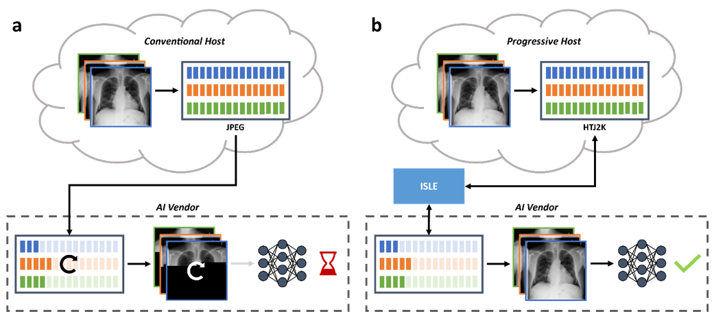

### 📢 Now published in _the Journal of Imaging Informatics in Medicine_!

We are excited to announce that the paper is now published in the _Journal of Imaging Informatics in Medicine_. Read the full paper [here](https://link.springer.com/article/10.1007/s10278-024-01173-z)!
___

  

# ISLE: An Intelligent Streaming Framework for High-Throughput AI Inference in Medical Imaging
### Pranav Kulkarni, Adway Kanhere, Eliot L. Siegel, Paul H. Yi, Vishwa S. Parekh

As the adoption of artificial intelligence (AI) systems in radiology grows, the increase in demand for greater bandwidth and computational resources can lead to greater infrastructural costs for healthcare providers and AI vendors. To that end, we developed ISLE, an intelligent streaming framework to address inefficiencies in current imaging infrastructures. Our framework draws inspiration from video on-demand platforms to intelligently stream medical images to AI vendors at an optimal resolution for inference from a single high-resolution copy using progressive encoding. We hypothesize that ISLE can dramatically reduce the bandwidth and computational requirements for AI inference, while increasing throughput (i.e., the number of scans processed by the AI system per second). We evaluate our framework by streaming chest x-rays for classification and abdomen CT scans for liver and spleen segmentation and comparing them with original versions of each dataset. For classification, our results show that ISLE reduced data transmission and decoding time by at least 92% and 88% respectively, while increasing throughput by more than 3.72x. For both segmentation tasks, ISLE reduced data transmission and decoding time by at least 82% and 88% respectively, while increasing throughput by more than 2.9x. In all three tasks, the ISLE streamed data had no impact to the AI system’s diagnostic performance (all _P_ > 0.05). Therefore, our results indicate that our framework can address inefficiencies in current imaging infrastructures by improving data and computational efficiency of AI deployments in the clinical environment without impacting clinical decision-making using AI systems.

## ISLE

We provide an experimental implementation of ISLE, the intelligent streaming framework detailed in the paper, that is capable of progressively encoding and decoding 2D and 3D medical images with partial bytestreams.

### OpenJPHpy

Our implementation uses OpenJPHpy (version 0.1) to progressively encode and decode medical images. More details are available [here](https://github.com/BioIntelligence-Lab/openjphpy).

### Encoder and Decoder

We currently only support the following formats:
- 2D
  - JPEG/JPG
  - PNG
  - DCM
  - NII/NII.GZ
- 3D
  - DCM
  - NII/NII.GZ

## Experimental Design

The experiments and analysis are detailed in `./src/analysis/`. The folder `clf` details the 2D chest x-ray classification experiments while `seg` details the 3D CT segmentation experiments.

### Contact us!

For any questions, please reach out to use via [email](mailto:pkulkarni@som.umaryland.edu,vparekh@som.umaryland.edu). 
